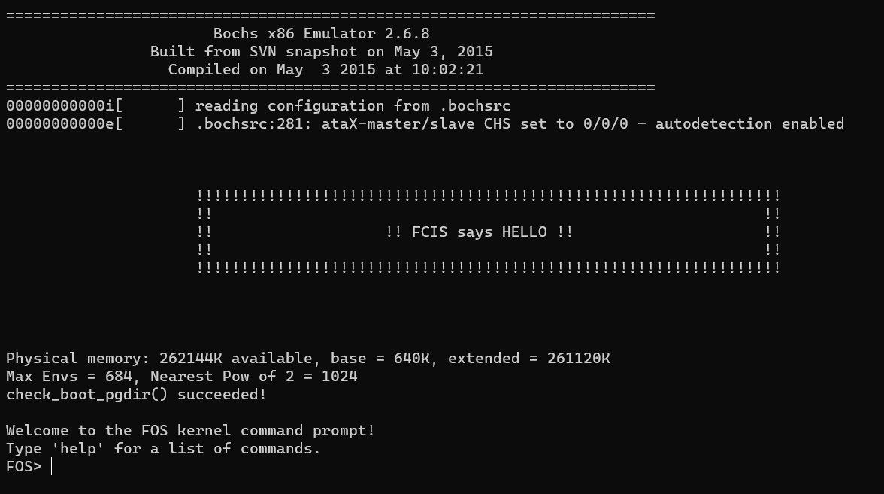

# FOS
An operating system capable of executing various programs.  
It optimizes CPU usage through its multiprocessing features   
and offers a user interface with commands for program execution.

### 1. Virtual Memory Management
Kernel creates a separate **4GB** virtual memory space for each process.   
This virtual space is connected to **RAM** or **Disk**
using **Paging Address Translation**.  
Both **virtual memory** and **physical memory** are divided into Pages of size **4KB**.  
This allows processes to seamlessly use **memory beyond the physical RAM constraints**  
while also providing **memory protection** and **sharing capabilities**.  
[_**Virtual Memory layout**_](https://github.com/Shehapp/FOS_OS/blob/main/inc/memlayout.h#L27)

### 2. Kernel Memory
Kernel Memory starts from a constant point, KERNEL_BASE, and extends up to the base plus 265MB in Virtual Memory  
and is mapped in RAM from 0 to 256MB.  
kernel Memory allocates executable files (.exe) of programs that need to run,  
along with page tables and directory tables, among other things. It includes it own heap and stack.  
Memory in the kernel heap can be allocated ([_show code_](https://github.com/Shehapp/FOS_OS/blob/main/kern/mem/kheap.c#L254)) using first fit ([_show code_](https://github.com/Shehapp/FOS_OS/blob/main/lib/dynamic_allocator.c#L180)) and best fit ([_show code_](https://github.com/Shehapp/FOS_OS/blob/main/lib/dynamic_allocator.c#L315)) strategies,  
and it also supports memory freeing ([_show code_](https://github.com/Shehapp/FOS_OS/blob/main/kern/mem/kheap.c#L348)) and reallocation ([_show code_](https://github.com/Shehapp/FOS_OS/blob/main/kern/mem/kheap.c#L640)).


### 2. User Memory
User Memory from 0 and extends up to KERNEL_BASE in Virtual Memory.  
The User Memory allocates Program Code and Data,
It includes it own heap and stack.  
Memory in the User heap can be allocated ([_show code_](https://github.com/Shehapp/FOS_OS/blob/main/lib/uheap.c#L55)) and it also supports memory freeing ([_show code_](https://github.com/Shehapp/FOS_OS/blob/main/lib/uheap.c#L134)).


### 3. Process
When a process needs to run, kernel creates a structure called 'Env' for it.  
This structure contains metadata about the process such as its id, status, and current working set ([_see more_](https://github.com/Shehapp/FOS_OS/blob/main/inc/environment_definitions.h#L91)).  
kernel handles this allocation and creates a 'working set' structure for each frame it allocates.  
We utilize both LRU ([_show code_](https://github.com/Shehapp/FOS_OS/blob/main/kern/trap/fault_handler.c#L346)) and FIFO ([_show code_](https://github.com/Shehapp/FOS_OS/blob/main/kern/trap/fault_handler.c#L277)) strategies to manage the working set of a process.


### 3. Kernel Mode
* Solve competition in Memory by virtual memory (RAM + DISK):  
  FOS can run programs with size greater than RAM.  
  the system can select a victims from environments and add em to DISK if RAM becomes full.


* Solve competition in CPU through multiprocessing:  
  This allows FOS to run multiple processes simultaneously.  
  The Round Robin (RR) ([_show code_](https://github.com/Shehapp/FOS_OS/blob/main/kern/cpu/sched.c#L49)) and Berkeley Software Distribution (BSD) ([_show code_](https://github.com/Shehapp/FOS_OS/blob/main/kern/cpu/sched.c#L320)) strategies are used to manage this.

### 4. User Mode


FOS provides a command line interface (CLI) which allows users to load, execute and kill programs.





* enable FIFO strategy
  ```c
  FOS> fifo
  ```


* enable LRU strategy
  ```c
  FOS> lru 2
  ```

* enable BSD strategy
  ```c
  // to enable BSD by 64 priorities and  5 quantum
  FOS> schedBSD 64 5
  ```


### 5. code example
  ```c
  //run merge sort and quick sort by lru and BSD
  FOS> lru 2
  FOS> schedBSD 64 10
  FOS> load qs 5000 100  // active list of size 5000 and second list of size 100
  FOS> load ms1 100 20 
  FOS> runall
  FOS> kill 2048 // call env_free to free up exit env
  FOS> kill 2049
  ```


### 6. References
* [ _BSD Scheduler_ ](https://www.scs.stanford.edu/23wi-cs212/pintos/pintos_7.html)
* [ _Round-robin scheduling_ ](https://en.wikipedia.org/wiki/Round-robin_scheduling)
* [ _Paging_strategy_ ](https://byjus.com/gate/paging-in-operating-system-notes/#:~:text=Paging%20in%20OS-,What%20is%20Paging%20in%20the%20OS%3F,also%20be%20separated%20into%20frames.)
* [ _Page Replacement Algorithms_](https://www.geeksforgeeks.org/page-replacement-algorithms-in-operating-systems/)
* [ _MMU Role in intel 80386_](https://pdos.csail.mit.edu/6.828/2004/readings/i386/c05.htm)


### 6. Contribution
If you think that anything can be improved in any way, please do suggest :  
Open pull request with improvements  
Discuss ideas in issues.


